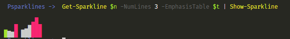

# PSparklines

Sparklines for PowerShell!

``` powershell
<#
.Synopsis
  This module is a very simple way to show text sparklines in the console.
.Description
  This module is a very simple way to show text sparklines in the console.
  It was ported to PowerShell from Python. The original package is sparklines.py.
  It is hosted on github.com at github.com/deeplook/sparklines.
  
  This module does implement emphasis in a manner similar to the original.
  However, instead of a simple string pattern, it uses Emphasis objects.
  Objects are added to a dictionary with functions that support auto-completion.

  This module does not implement the batching (array splitting) that sparklines used.
  This module does not implement ANSI colors, although the new consoles for PowerShell support color codes.

  This module also outputs Sparklines as objects and uses two different functions to write them.
  `Show-Sparkline` will write the sparkline to the host and STDINFO (6) and colorize based on an emphasis table.
  `Write-Sparkline` will write the sparkline to STDOUT (1) as a string for further parsing or use.
  Because `Get-Sparkline` will write objects, the user can write a custom function to write the sparkline
  how they need if the default functions are inadequate.

  Cmdlets/Functions for Sparklines:
    Get-Sparkline
    Write-Sparkline
    Show-Sparkline

  Cmdlets/Functions for Emphasis:
    New-EmphasisTable
    Add-Emphasis
    Set-Emphasis
.Example
  PS> Get-Sparkline 25, 50, 75, 100, 25 -EmphasisTable (New-EmphasisTable | Add-Emphasis Red -Gt 50) |
    Show-Sparkline

    Display a sparkline in the host of line height 1 with every bar representing a number greater than 50
    as ConsoleColor.Red
#>
```

## Some more examples

``` powershell
PS> Get-Sparkline 1,2,3,4,5,6,7,8 | Write-Sparkline

▁▂▃▄▅▆▇█


PS> $n = (0..10).Foreach{ Get-Random -Minimum 1 -Maximum 100 }

# 36, 32, 20, 55, 2, 35, 39, 48, 66, 86, 55

PS> Get-Sparkline $n -NumLines 3 | Write-Sparkline
        ▃█
▂▁ █ ▂▃▆███
██▆█▁██████

PS> $t = New-EmphasisTable |
    Add-Emphasis Red -Gt 50 |
    Add-Emphasis Green -Eq 36
```


