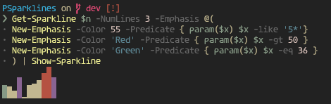

# PSparklines

Sparklines for PowerShell!

## Install

### PowerShell Gallery

```powershell
Install-Module PSparklines # -Scope CurrentUser
```

### Scoop

```powershell
scoop bucket add endo-scoop "https://github.com/endowdly/endo-scoop"  # Name the bucket whatever you'd like :)
scoop install psparklines
```

## Examples

``` powershell
PS> Get-Sparkline 1,2,3,4,5,6,7,8 | Write-Sparkline

▁▂▃▄▅▆▇█


PS> $n = (0..10).Foreach{ Get-Random -Minimum 1 -Maximum 100 }

# 36, 32, 20, 55, 2, 35, 39, 48, 66, 86, 55

PS> Get-Sparkline $n -NumLines 3 | Write-Sparkline
        ▃█
▂▁ █ ▂▃▆███
██▆█▁██████

PS> Get-Sparkline $n -NumLines 3 -Emphasis @(
    New-Emphasis -Color 55 -Predicate { param($x) $x -like '5*' } # 55 is like a dark magenta
    New-Emphasis -Color 'Red' -Predicate { param($x) $x -gt 50 }
    New-Emphasis -Color 'Green' -Predicate { param($x) $x -eq 36 }
) | Show-Sparkline 
```



```powershell

# To show the difference between 4 bit color and 8 bit color *if your console supports VT ANSI commands and 8 bit color*

PS> Get-Sparkline $n -NumLines 3 -Emphasis @(
    New-Emphasis -Color 55 -Predicate { param($x) $x -like '5*' } # 55 is like a dark magenta
    New-Emphasis -Color 'Red' -Predicate { param($x) $x -gt 50 }
    New-Emphasis -Color 'Green' -Predicate { param($x) $x -eq 36 }

) | Show-Sparkline -Ansi
```


## Emphasis

As shown above, the **first** Emphasis object that has a true predicate will determine the color of the spark index.

## Why?

This is just a quick little module to help visualize sparklines in the command-line.
It is explained better in the [sparklines repo](http://github.com/deeplook/sparklines).
The [Wikipedia](https://en.wikipedia.org/wiki/Sparkline) entry also offers insight.
